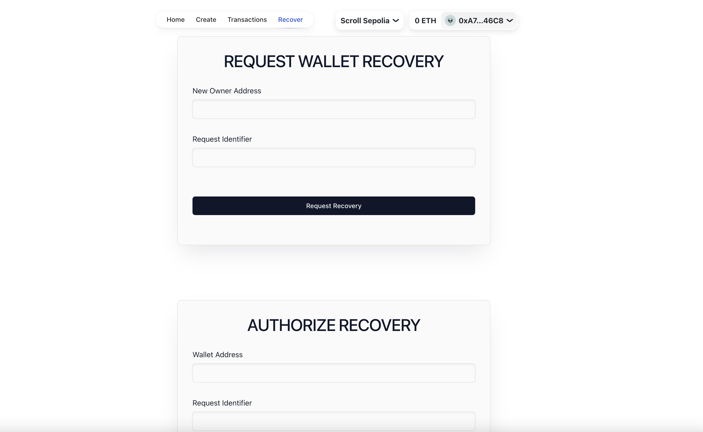

# FLIP WALLET ERC-4337 ACCOUNT ABSTRACTION DAPP

This Solidity program is a full stack "Account Abstraction Wallet" program that impliments the factory contract model to allow individuals create a personalized and recoverable account abstraction wallet.

## Description

This program is a simple contract written in Solidity, a programming language used for developing smart contracts on the Ethereum blockchain. The contract is a factory contract that deploys new instances of an account abstraction wallet for individuals, these wallet have a defined recovery method to restore ownership of the wallet by implementing trusted parties who can help vouch for you durig account recovery situations.

## LIVE LINK
https://erc-4337-account-abstraction-wallet.vercel.app/

## Executing program
#### STEP 1
- CREATE A WALLET.

#### STEP 2
- TRANSACT USING YOUR WALLET (TRANSFER, DEPOSIT, EXECUTE OPERATION).

#### STEP 3
- REQUEST FOR ACCOUNT RECOVERY / AUTHORIZE RECOVERY

## Authors

Idogwu Chinonso
[@scrollHacker](https://twitter.com/ChinonsoIdogwu)

## License

This project is licensed under the MIT License - see the LICENSE.md file for details